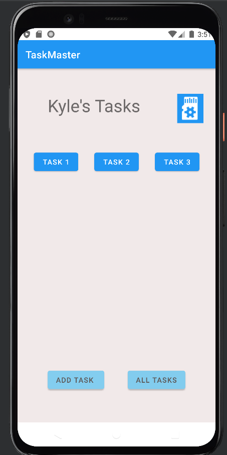
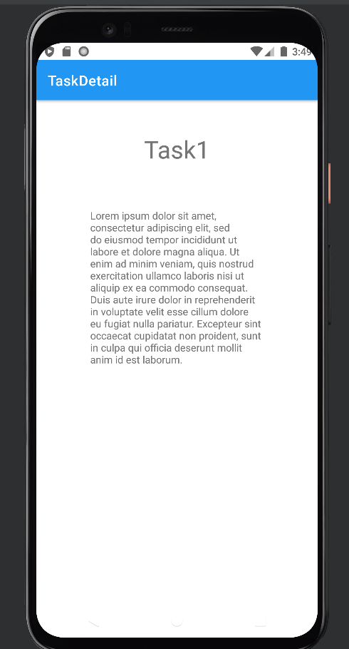
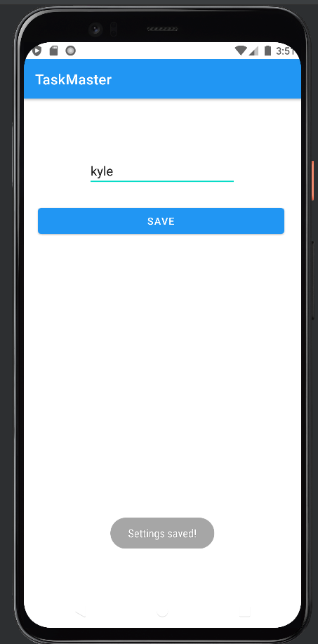
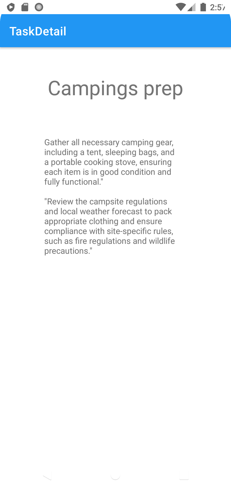

# taskmaster

# Lab 26

Feature Tasks
Homepage
The main page should be built out to match the wireframe. In particular, it should have a heading at the top of the page, an image to mock the “my tasks” view, and buttons at the bottom of the page to allow going to the “add tasks” and “all tasks” page.

Add a Task
On the “Add a Task” page, allow users to type in details about a new task, specifically a title and a body. When users click the “submit” button, show a “submitted!” label on the page.

All Tasks
The all tasks page should just be an image with a back button; it needs no functionality.

# ALL TASKS

## MY TASKS

## NEW TASK

# Lab 27

Feature Tasks
Task Detail Page
Create a Task Detail page. It should have a title at the top of the page, and a Lorem Ipsum description.

Settings Page
Create a Settings page. It should allow users to enter their username and hit save.

Homepage
The main page should be modified to contain three different buttons with hardcoded task titles. When a user taps one of the titles, it should go to the Task Detail page, and the title at the top of the page should match the task title that was tapped on the previous page.

The homepage should also contain a button to visit the Settings page, and once the user has entered their username, it should display “{username}’s tasks” above the three task buttons.

# Homepage

## TaskDetail

## Settings

# Lab 28

Feature Tasks
Task Model
Create a Task class. A Task should have a title, a body, and a state. The state should be one of “new”, “assigned”, “in progress”, or “complete”.

Homepage
Refactor your homepage to use a RecyclerView for displaying Task data. This should have hardcoded Task data for now.

Some steps you will likely want to take to accomplish this:

Create a ViewAdapter class that displays data from a list of Tasks.
In your MainActivity, create at least three hardcoded Task instances and use those to populate your RecyclerView/ViewAdapter.
Ensure that you can tap on any one of the Tasks in the RecyclerView, and it will appropriately launch the detail page with the correct Task title displayed.

## TaskDetail

## HomeScreen Reycle 

